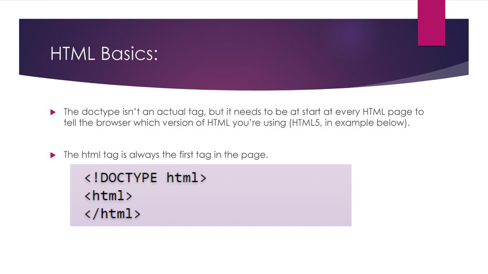

# Summary Extra MarkUp & HTML5 layout
## Extra Markup :
1. DOCTYPES tell browsers which version of HTML you are using.

2. You can add comments to your code between the markers.

3. The id and class attributes allow you to identify particular elements.

4. The meta tag allows you to supply all kinds of information about your web page .

5. Escape characters are used to include specialcharacters in your pages such as < , >, and ©.

6. iframes tag cut windows into your web pages through which other pages can be displayed.

# HtMl5 Layout :

> **Headers & Footers**
- The main header or footer that appears at the top or bottom of every page on the site
- A header or footer for an individual article or section within the page.

> **Navigation** 

- The nav element is used to contain the major navigational blocks on the site such as the primary site navigation.

> **Heading Groups**

- The purpose of the hgroup element is to group together a set of one or more h1 through h6 elements so that they are treated as one single heading.

           

